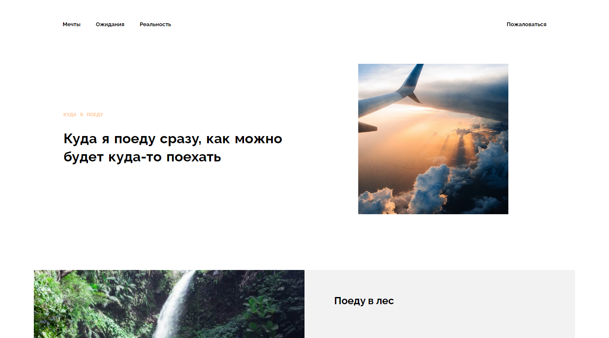

# Проект: Куда я поеду

Конкурсный проект выполненный в рамках курса "Веб-разработчик" от Яндекс Практикум, занявший одно из призовых мест :trophy: Проект представляет из себя небольшой сайт состоящий из нескольких страниц. Цель проекта, рассказать о мечтах, ожидании и реальности от долгожданного путешествия. Показать места в которых можно побывать и какие впечатления можно получить

## Оглавление

## Обзор проекта

### Задачи проекта

Проект был призван показать навыки которыми мы овладели за период обучению HTML, CSS, и адаптивной вёрстки. Также данный проект является первым опытом совместной работы над проектом с помощью Git и GitHub.

### Функциональность проекта

Проект выполнен в виде сайта состоящего из нескольких страниц. В проекте реализованы различные подходы к позиционированию и выравниванию элементов, в том числе Flexbox и Grid Layout. Также в проекте применён JS (ещё до его изучения в рамках курса) для работы с модальным окном и меню-гамбургером.

### Screenshot

### Директории проекта

- `/blocks` — директория с CSS файлами
- `/fonts` — директория со шрифтами
- `/images` — директория с файлами изображений
- `/pages` — директория с файлами страниц
- `/vendor` — директория с файлами библиотек

### Запуск проекта

Поскольку в проекте не используются сборщики или планировщики, то проект нужно просто клонировать и открыть index.html в браузере или с помощью LiveServer.

### Ссылки

- [Ссылка на репозиторий проекта](https://github.com/Bjorn86/yp-contest)
- [Ссылка на демо-страницу проекта](https://bjorn86.github.io/yp-contest/)

## Ход выполнения проекта

### Используемые технологии

- HTML
- CSS
- JS
- Семантическая вёрстка
- Адаптивная вёрстка
- БЭМ, включая использование схемы файловой структуры Nested

### Чему мы научились работая над проектом

- Позиционированию и выравниванию элементов страницы при помощи различных подходов
- Семантической вёрстке
- Адаптивной вёрстке
- Методологии БЭМ
- Работе с JS
- Совместной работе

## Авторы

**Данила Легкобытов**

- e-mail: [legkobytov-danila@yandex.ru](mailto:legkobytov-danila@yandex.ru)
- Telegram: [@danila_legkobytov](https://t.me/danila_legkobytov)

[**Максим Оржеховский**](https://github.com/Maksim-Orzhekhovskiy)
